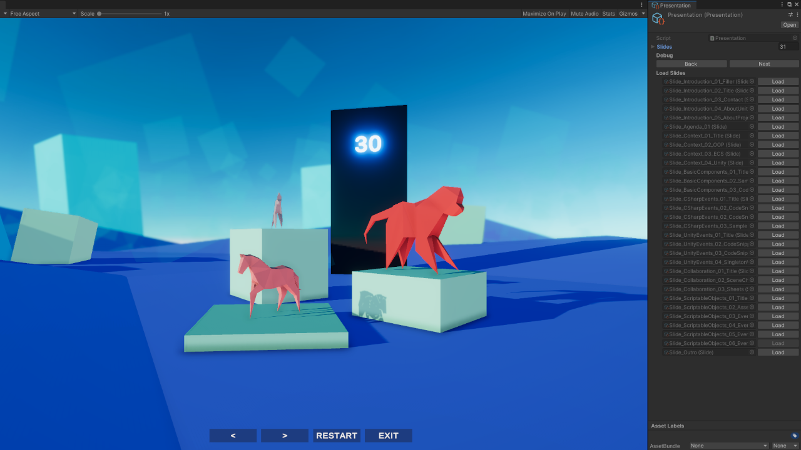

  

# Gamedev Tools

Because screw Google Slides - presentation on various game development patterns and tools in Unity. You can find the presentation logic in an embedded package
at [Packages/com.edd.simple-presenter](../Packages/com.edd.simple-presenter).

The latest release can be downloaded [here](https://github.com/Edvinas01/gamedev-tools/releases/latest).

## Requirements

- Unity 2022.3.x, install via [Unity Hub](https://unity3d.com/get-unity/download)
- [Rider IDE](https://www.jetbrains.com/rider) (optional)
- [Git](https://git-scm.com/downloads)
